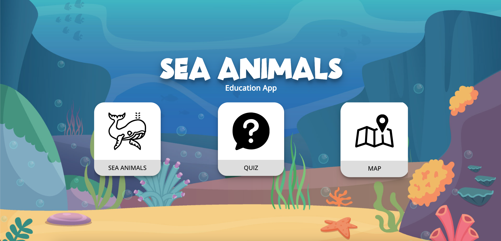
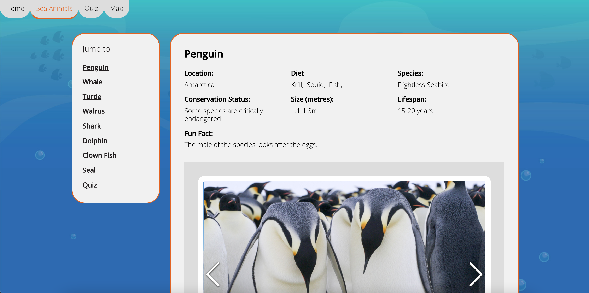
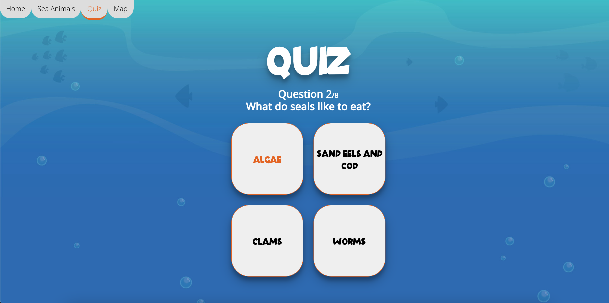
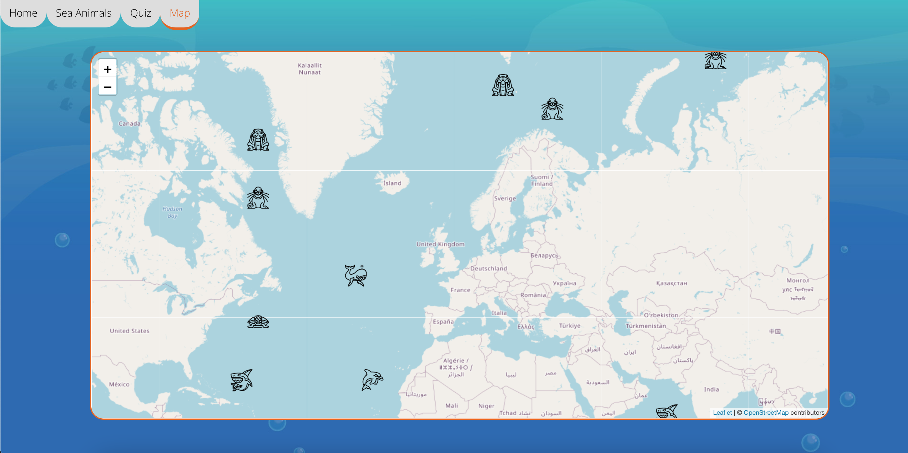

# Educational App - Sea Animals
The BBC are looking to improve their online offering of educational content on marine life by developing some interactive browser applications that display information in a fun and interesting way. 

## MVP
Using react, mongoDB and express. Performing unit and integration testing where appropriate using React testing and Cypress. 

A user should be able to:

* View some educational content on marine life, including useful information like diet, location and conservation status 
* Be able to interact with the page to move through different sections of content
* Quiz themselves on their new knowledge and have their final score be shown

## Possible Extensions
* Implement a react library to create an interactive map
* Allow a user to input a username
* Show a user's previous high score
* Style the app appropriately with CSS
* Make the app responsive
* Deployment using Firebase

# Getting Started
These instructions should get you a copy of the project up and running on your local machine for development purposes.

Server
Install server dependencies:

<code>cd server</code>

<code>npm install</code>

Seed the database:

<code>npm run seeds</code>

Run express:

<code>npm run server:dev</code>

Client

<code>cd ../client</code>

<code>npm install</code>

<code>npm start</code>

